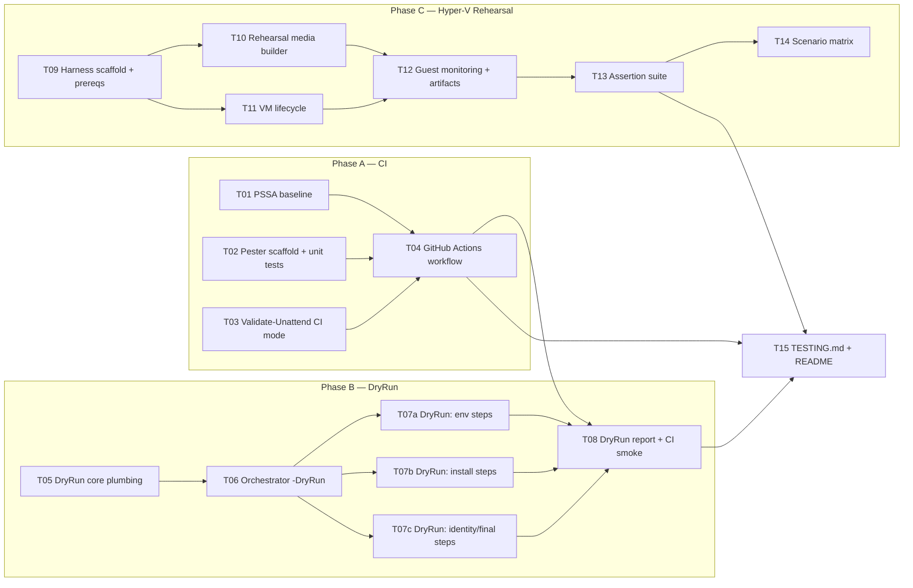

# FABLE_TASKS — Implementation Plan: Test Bench for the Win11-USB Toolkit

Implementation plan for the three-tier testing strategy from `FABLE_ENHANCE.md` ("The Final Question"): make it possible to prove a toolkit change is safe **before** it reaches a client's notebook.

- **Tier 3 — CI**: catch cheap defects (syntax, analyzer findings, broken helpers, invalid unattend XML) on every PR.
- **Tier 2 — `-DryRun` mode**: run the whole orchestrator on any machine and log exactly what each step *would* do, without doing it.
- **Tier 1 — Hyper-V rehearsal harness**: one command that boots a Gen-2 VM (vTPM + Secure Boot) from the Win11 ISO plus the generated USB contents and runs the entire unattended flow end-to-end — wipe, reboots, resume, scrub — then asserts the result.

Build order is Tier 3 → Tier 2 → Tier 1 (cheapest feedback first; each tier also helps validate the next), but the phases have independent roots so an orchestrator can run them concurrently.

---

## How To Use This File (Agent Orchestration)

- Each task has a stable ID (`T01`…`T15`), a **Depends on** list (hard prerequisites — do not start until all listed tasks are merged/complete), and a **Blocks** list (the inverse, for scheduling).
- Tasks with no unmet dependencies may run **in parallel**. The wave schedule at the end is the precomputed parallel plan.
- Every task lists **Acceptance criteria**; a task is not complete until they all pass. Where a criterion is a command, run it verbatim.
- Work each task on its own short-lived branch off the integration branch, merge back when acceptance passes. Tasks in the same wave must not edit the same file where avoidable; where overlap is flagged (T07a/b/c in `Start-Deployment.ps1`), the noted merge order applies.
- Effort: **S** ≈ ≤half day, **M** ≈ 1 day, **L** ≈ 2–3 days.

### Dependency graph

---

## Phase A — CI (Tier 3)

### T01 — PSScriptAnalyzer configuration and zero-finding baseline

**Effort:** S | **Depends on:** — | **Blocks:** T04 | **Parallel-safe with:** T02, T03, T05, T09

Add a repo-root `PSScriptAnalyzerSettings.psd1` (rules: default set + `PSAvoidUsingPlainTextForPassword`, `PSAvoidUsingConvertToSecureStringWithPlainText` explicitly *suppressed only where the deployment design requires plaintext handling*, each suppression justified with an inline `[Diagnostics.CodeAnalysis.SuppressMessage]` attribute and comment). Run PSSA across `*.ps1` at root and `Deployment\Scripts\`, fix or suppress every finding so the tree is clean.

**Deliverables:** `PSScriptAnalyzerSettings.psd1`; any script fixes; suppression justifications.
**Acceptance criteria:**
- `Invoke-ScriptAnalyzer -Path . -Recurse -Settings .\PSScriptAnalyzerSettings.psd1` returns zero findings on pwsh 7 (Linux and Windows).
- No behavioural changes (spot-check: `Validate-Unattend.ps1` still passes against the template).

### T02 — Pester scaffold and unit tests for `Common.ps1` pure functions

**Effort:** M | **Depends on:** — | **Blocks:** T04 | **Parallel-safe with:** T01, T03, T05, T09

Create `Tests\Unit\` with Pester v5 tests for the platform-independent functions in `Deployment\Scripts\Common.ps1`: `ConvertTo-PlainHashtable`, `Merge-Config`, `Get-SafeName`, `Get-SafeComputerName`, `ConvertTo-NormalizedManufacturer`, `ConvertTo-NormalizedModel`, `Split-CommandLineArguments`, `ConvertTo-ProcessArgumentString`, `New-RandomPassword`, `Get-DotEnvValue`, and state round-trips (`New-DeploymentState` → `Write-DeploymentState` → `Read-DeploymentState` using a temp dir). `Common.ps1` currently executes nothing at dot-source time beyond variable setup, so it can be dot-sourced in tests directly; add a guard only if a test proves otherwise. Windows-only functions (CIM, scheduled tasks, toasts) are out of scope here — they get exercised by Tiers 1–2.

**Deliverables:** `Tests\Unit\Common.Tests.ps1` (split by area if large); `Tests\README.md` (how to run locally).
**Acceptance criteria:**
- `Invoke-Pester -Path Tests/Unit -Output Detailed` passes on pwsh 7 on Linux **and** Windows PowerShell 5.1 (the deployment's actual runtime).
- ≥ 3 test cases per listed function including at least one adversarial input each (empty string, illegal chars, nested arrays for hashtable/merge functions).

### T03 — `Validate-Unattend.ps1` CI mode

**Effort:** S | **Depends on:** — | **Blocks:** T04 | **Parallel-safe with:** T01, T02, T05, T09

Make the validator reliably runnable in CI without the ADK: add a `-Ci` switch that (a) never prompts, (b) exits non-zero on any error-level finding, (c) skips schema-DLL validation with a clearly logged notice instead of a warning wall, and (d) additionally validates the *generated* answer file by running the generation logic against `Deployment\Config\deployment_config.json` into a temp folder (extract the generation of `Autounattend.xml` + `OSIT-DiskPart.txt` from `Initialize-UsbDeployment.ps1` into a shared function both scripts call, so CI validates what production would actually write — including the wipe path and the 259-char RunSynchronous constraint).

**Deliverables:** `-Ci` switch; refactored shared generation function (e.g. `New-GeneratedUnattendContent` in a new `Deployment\Scripts\UnattendGeneration.ps1` dot-sourced by `Initialize-UsbDeployment.ps1` and `Validate-Unattend.ps1`).
**Acceptance criteria:**
- `pwsh -File Validate-Unattend.ps1 -Ci` exits 0 on the current tree; corrupting the template XML makes it exit non-zero.
- With `wipe_repartition_drive=true` in a temp config, the generated-file validation confirms the diskpart artifact split and the ≤259-char command.
- `Initialize-UsbDeployment.ps1` output is byte-identical before/after the refactor for the same inputs (compare in a temp staging run).

### T04 — GitHub Actions CI workflow

**Effort:** S | **Depends on:** T01, T02, T03 | **Blocks:** T08, T15

Add `.github/workflows/ci.yml` running on `pull_request` and `push` to `main`:
- **lint** (ubuntu-latest): PSSA per T01.
- **unit** (matrix: ubuntu-latest pwsh, windows-latest pwsh, windows-latest PowerShell 5.1): Pester per T02.
- **unattend** (windows-latest): `Validate-Unattend.ps1 -Ci` per T03.
Keep the existing `mirror.yml` untouched. Badge in README optional.

**Deliverables:** `.github/workflows/ci.yml`.
**Acceptance criteria:** all jobs green on a PR containing this workflow; a deliberately broken script in a scratch PR turns lint/unit red (verify, then discard the scratch PR).

---

## Phase B — `-DryRun` Mode (Tier 2)

Design invariants for the whole phase:
- **Propagation:** `Start-Deployment.ps1 -DryRun` sets `$env:OSIT_DEPLOYMENT_DRYRUN = '1'`; `Common.ps1` reads it into `$script:DeploymentDryRun` at dot-source time, so every child step script inherits the mode with zero signature churn. (`-DryRun` also implies `-NonInteractive` unless overridden.)
- **State isolation:** in dry-run, `Get-DeploymentPaths` returns a shadow state file (`deployment_state.dryrun.json`) and a `Logs\...\dryrun-<runid>` log folder; a real deployment's state/logs are never touched, and the run lock uses a separate mutex name so a dry run can't block a real resume.
- **Action logging:** a single helper is the audit trail: `Write-DryRunAction -Step <s> -Action <text> -Data <obj>` logs at `Info` with a `DRYRUN` prefix *and* appends to `state.dryrun_actions` for the report (T08).
- **Read-only is allowed, mutation is not.** Scans, detections, and queries still run for real (that's the value); anything that changes machine state is replaced by `Write-DryRunAction`.

### T05 — DryRun core plumbing in `Common.ps1`

**Effort:** M | **Depends on:** — (soft: T02 merged first so tests can extend) | **Blocks:** T06

Implement the invariants above inside `Common.ps1`:
- `$script:DeploymentDryRun` + `Test-DeploymentDryRun` accessor; `Write-DryRunAction`.
- `Invoke-ExternalCommand`: refuse to execute in dry-run unless called with a new `-ReadOnly` switch (caller asserts the command mutates nothing, e.g. `robocopy /L`, `winget list`); otherwise log the exact FilePath + argument string that would have run and return a synthetic `exit_code = 0` result object.
- `Request-DeploymentReboot`: log "would reboot: <reason>", record `state.dryrun_reboots += reason`, **return instead of exiting**, so one dry-run pass traverses every step.
- `Register-DeploymentResumeTask`, `Unregister-DeploymentResumeTask`, `Enable-DeploymentAutoLogon`: log-and-return in dry-run.
- `Show-DeploymentToast`: prefix title with `[DRY RUN]`.
- Shadow paths per the invariants (`Get-DeploymentPaths`, `Enter-DeploymentRunLock`, `Initialize-DeploymentLogging`).

**Deliverables:** `Common.ps1` changes; `Tests\Unit\DryRun.Tests.ps1` covering the helper, shadow paths, and `Invoke-ExternalCommand` refusal.
**Acceptance criteria:** unit tests pass on 5.1 and pwsh 7; with the env var unset, a byte-level diff of behaviour is nil (existing T02 tests still pass unchanged).

### T06 — Orchestrator `-DryRun` in `Start-Deployment.ps1`

**Effort:** S | **Depends on:** T05 | **Blocks:** T07a, T07b, T07c

Add the `-DryRun` switch: set the env var before dot-sourcing `Common.ps1`, force non-interactive defaults, banner the mode loudly at start, skip the device-identity state prompt (always fresh shadow state), and on completion print + log a one-line summary (`DRYRUN RESULT: steps=<n> actions=<n> would-reboot=<n>`). `Invoke-ComputerNameStep` and `Invoke-CreateLocalAdminStep` live in this file — convert their mutations (`Rename-Computer`, `New-LocalUser`, `Add-LocalGroupMember`, password generation/export) to `Write-DryRunAction` calls under dry-run, keeping their detection/validation logic live.

**Deliverables:** `Start-Deployment.ps1` changes.
**Acceptance criteria:** on a Windows machine with the repo checked out (no USB), `powershell -File Deployment\Scripts\Start-Deployment.ps1 -UsbRoot . -DryRun` completes the full step loop with exit 0, creates only `deployment_state.dryrun.json` + dry-run logs, and leaves no scheduled task, no renamed computer, no local users, no registry changes (verify via before/after snapshot in the acceptance script).

### T07a — DryRun support: environment steps

**Effort:** S | **Depends on:** T06 | **Blocks:** T08 | **Parallel-safe with:** T07b, T07c (different files)

`Install-NetworkDrivers.ps1`, `Configure-MspWifi.ps1`, `Invoke-PreflightChecks.ps1`, `Invoke-LocalHandover.ps1`, `Configure-PowerSettings.ps1`:
- Network/model driver installs: enumerate `.inf` files found and log `would pnputil /add-driver` per folder (the enumeration is the real value — it catches empty/mislaid driver folders).
- MSP WiFi: validate config + password presence, log `would create WLAN profile <ssid>` — never touch `netsh wlan add/connect`.
- Preflight: already read-only — runs fully; in dry-run, downgrade environment-dependent failures (internet, AC power, elevation) to warnings so config errors still fail but bench-PC realities don't.
- LocalHandover: run `robocopy` with `/L` via `Invoke-ExternalCommand -ReadOnly` to list what would copy; log would-copy of `.env`; do not switch deployment root.
- PowerSettings: log the exact `powercfg` command lines that would run.

**Acceptance criteria:** dry-run traverses all five steps against the repo tree; each emits ≥1 `DRYRUN` action line with concrete values (paths, SSID, powercfg args); zero machine mutation (snapshot check).

### T07b — DryRun support: install steps

**Effort:** M | **Depends on:** T06 | **Blocks:** T08 | **Parallel-safe with:** T07a, T07c

`Install-WindowsUpdates.ps1`, `Install-WingetApps.ps1`, `Install-LocalApps.ps1`, `Install-DattoRmm.ps1`:
- WindowsUpdates: perform the *scan* (PSWindowsUpdate `Get-WindowsUpdate` or COM search) when online, log the titles that would install and whether a reboot would follow; skip install/download. Offline: log the skip. Never bootstrap-install PSWindowsUpdate in dry-run — log `would Install-Module PSWindowsUpdate` instead.
- WingetApps: run real `winget list`-based detection per package, log installed vs `would winget install <id> <args>`; config schema errors still throw.
- LocalApps: verify each configured installer file exists on media + detection logic parses, log the exact command line that would run; missing required installer files **fail** the dry run (that's a real config defect).
- DattoRmm: validate UUID (existing logic), log would-download URL and would-install command; no download.

**Acceptance criteria:** dry-run on an online Windows box lists real scan results (updates found, packages resolved); a deliberately bad `winget_packages.json` entry or missing local installer fails the dry run with a clear message.

### T07c — DryRun support: identity and finalisation steps

**Effort:** M | **Depends on:** T06 | **Blocks:** T08 | **Parallel-safe with:** T07a, T07b

`Configure-DesktopItems.ps1`, `Get-AssetInventory.ps1`, `Write-DeploymentReport.ps1`, `Send-DeploymentEmail.ps1`, plus the `Complete` block in `Start-Deployment.ps1`:
- DesktopItems: list shortcuts that would be removed/created (real directory scan, no deletion).
- AssetInventory: runs for real (read-only) but writes into the dry-run report folder.
- FinalReport: writes the report into the dry-run folder, flagged `"dry_run": true`.
- EmailReport: full SMTP config + attachment resolution, log would-send (server, recipients, attachment list); optional `-DryRunSendTest` later — out of scope now.
- **Complete scrub preview:** enumerate every unattend cache path, Winlogon value, (post-P0-fix) local `.env` and WLAN profile that *currently exists* and log `would scrub <x>` vs `not present <x>`. This is the credential-scrub audit the enhancement report called out — it must list findings even when the answer is "nothing to scrub".
- Merge order note: T07c touches `Start-Deployment.ps1` (Complete block) which T06 also edited — rebase T07c on T06's merged result; T07a/T07b touch only their own step files.

**Acceptance criteria:** full dry-run ends with exit 0 and a scrub-preview section in the log; report JSON carries `dry_run: true`; no email is sent (verify with an unreachable SMTP host configured — must not error).

### T08 — DryRun summary report, docs, and CI smoke job

**Effort:** S | **Depends on:** T07a, T07b, T07c, T04 | **Blocks:** T15

Aggregate `state.dryrun_actions` into `Deployment\Reports\...\dryrun-summary-<runid>.md` grouped by step (what would install, rename, scrub, email, reboot). Add a **dryrun-smoke** job to `ci.yml` (windows-latest): run `Start-Deployment.ps1 -UsbRoot $env:GITHUB_WORKSPACE -DryRun` with a CI config overlay (internet-dependent scans tolerated, `require_ac_power=false`) and assert exit 0 + summary file exists + zero mutation snapshot. Document the mode in README (`## Dry Run`).

**Acceptance criteria:** CI smoke job green; summary file renders with ≥1 entry per enabled step; README section explains when to use dry-run (config/profile changes, pre-USB-initialise sanity check).

---

## Phase C — Hyper-V Rehearsal Harness (Tier 1)

All harness code lives under `Test\Rehearsal\` (host-side only; nothing here ships on the USB). Entry point: `Test\Rehearsal\Invoke-DeploymentRehearsal.ps1`. Requires: Windows 10/11 Pro host with Hyper-V, ~60 GB free, a Win11 ISO, elevation.

Media strategy (key design decision): the VM boots Windows Setup from the **ISO** (DVD drive), and the "USB" is a second **VHDX** formatted NTFS with volume label `1S-WIN11` containing `Autounattend.xml`, `OSIT-DiskPart.txt`, `.env`, and `Deployment\`. Windows Setup discovers `Autounattend.xml` from any attached drive root, and the toolkit already finds its media by *volume label, not bus type* (`Get-UsbRoot` → `Win32_Volume`/`Get-Volume -FileSystemLabel`), so a fixed disk labelled `1S-WIN11` behaves identically to the physical stick. The OS disk must enumerate as the disk id the config wipes (default 0) — attach the OS VHDX to SCSI controller 0/LUN 0 and the media VHDX after it, and assert ordering inside WinPE via the diskpart log.

### T09 — Harness scaffold and prerequisites checker

**Effort:** S | **Depends on:** — | **Blocks:** T10, T11 | **Parallel-safe with:** T01, T02, T03, T05

Create `Test\Rehearsal\` with: `Invoke-DeploymentRehearsal.ps1` (parameter surface only: `-IsoPath` [mandatory], `-WorkingDirectory`, `-Scenario` [default `Standard`], `-VmName`, `-MemoryGB` [default 8], `-CpuCount` [default 4], `-OsDiskGB` [default 80], `-TimeoutMinutes` [default 180], `-KeepVm`, `-SkipAssertions`), a `RehearsalCommon.ps1` for shared helpers, and `Test-RehearsalPrerequisites` (Hyper-V feature enabled, elevated, ISO exists and is bootable media, free disk space, `Default Switch` present, no VM name collision). Also add `Test\` to the `Initialize-UsbDeployment.ps1` copy exclusions if any glob would catch it (verify; likely none since the initializer copies specific folders).

**Acceptance criteria:** running the entry point with `-WhatIf`-style prereq check on a non-Hyper-V machine produces a clear actionable failure list; on a capable host it passes and prints the resolved plan.

### T10 — Rehearsal media builder

**Effort:** M | **Depends on:** T09 | **Blocks:** T12 | **Parallel-safe with:** T11

`New-RehearsalMedia` in `RehearsalCommon.ps1`: create a dynamic VHDX (16 GB), mount, initialise GPT, single NTFS volume labelled `1S-WIN11`, then **run the real `Initialize-UsbDeployment.ps1 -UsbRoot <mounted letter>`** against it — the rehearsal must exercise the same generation path production uses, not a copy of it. Feed secrets from a rehearsal `.env` (generated throwaway OSIT password per run; WiFi/SMTP disabled by config overlay unless the scenario enables them). Apply the scenario's config overlay (T14 defines them; `Standard` = `wipe_repartition_drive=true`, `msp_wifi_setup.enabled=false`, `require_ac_power=false` [VMs report no battery — verify the existing "no battery = warn" path suffices], `computer_name_mode=serial`, `install_winget_apps=true` with a 1-package list, `datto_rmm_site_id_uuid=""`). Dismount cleanly.

**Acceptance criteria:** builder produces a VHDX whose mounted root passes `Validate-Unattend.ps1 -Path <root>\Autounattend.xml -Generated -ConfigPath <root>\Deployment\Config\deployment_config.json`; volume label is exactly `1S-WIN11`; re-running the builder is idempotent (fresh VHDX each time).

### T11 — VM lifecycle module

**Effort:** M | **Depends on:** T09 | **Blocks:** T12 | **Parallel-safe with:** T10

`New-RehearsalVm` / `Remove-RehearsalVm` / `Checkpoint-Rehearsal` in `RehearsalCommon.ps1`:
- Gen-2 VM, dynamic memory off (fixed, per `-MemoryGB`), `-CpuCount` vCPUs, `Default Switch`.
- OS disk: new dynamic VHDX (per `-OsDiskGB`) at SCSI 0/LUN 0; media VHDX from T10 at LUN 1; DVD with the ISO; firmware boot order DVD → OS disk.
- **vTPM + Secure Boot:** ensure a local `HgsGuardian` exists (`New-HgsGuardian -GenerateCertificates` once, reused), `Set-VMKeyProtector -NewLocalKeyProtector`, `Enable-VMTPM`, `Set-VMFirmware -SecureBootTemplate MicrosoftWindows` — this is what makes the rehearsal representative of real notebooks (TPM-gated Win11 setup, BitLocker-capable).
- Checkpoints (standard, not production) at: `pre-boot` (before first start), `post-install` (first heartbeat after OOBE), `pre-complete` (when monitoring sees the state reach `EmailReport`). Note in docs: checkpoints on vTPM VMs are restorable only on hosts holding the guardian key — fine for a single bench host.
- Teardown removes VM + disks unless `-KeepVm`.

**Acceptance criteria:** module creates a VM that boots the ISO with Secure Boot ON and TPM present (`Get-VMSecurity`); teardown leaves no VM, VHDX, or checkpoint behind; guardian creation is idempotent across runs.

### T12 — Guest monitoring and artifact collection

**Effort:** L | **Depends on:** T10, T11 | **Blocks:** T13

The harness's eyes during the run:
- **Phase 1 (Windows Setup / WinPE):** no guest agent available — monitor VM heartbeat/uptime and watch for the reboot out of setup. Timeout gate (default 40 min) for "never left setup" (the `0x80004005` class of failure). On timeout, capture a VM screenshot (`Get-VMScreenshot` via WMI `Msvm_VirtualSystemManagementService`) into the artifact folder for diagnosis.
- **Phase 2 (deployed OS):** once Hyper-V integration heartbeat is up, poll via **PowerShell Direct** (`Invoke-Command -VMName -Credential OSIT`, password from the rehearsal `.env`) every 30 s: read `deployment_state.json` from the media volume (resolve by label in-guest), surface `overall step n/17`, current step, and reboot transitions on the host console (reuse `Get-DeploymentStatus.ps1` in-guest with `-Json` for exactly this — it already computes everything). Tolerate PS Direct outages across the deployment's own reboots.
- **Terminal detection:** `Complete` in `completed_steps` → success; `last_error` present with no process running → failure; overall `-TimeoutMinutes` → timeout. Take the `pre-complete` checkpoint when state first shows `EmailReport` reached.
- **Artifact harvest:** on any terminal state, copy the full `Deployment\Logs`, `Deployment\Reports`, `Deployment\State`, and (if handover scenario) `C:\1S-WIN11` from the guest via PS Direct `Copy-Item -FromSession` into `Test\Rehearsal\Artifacts\<timestamp>\`, plus `OSIT-DiskPart.log` from the media root, plus a final screenshot.

**Acceptance criteria:** a full `Standard` rehearsal on a bench host runs unattended to a terminal state; the host console shows live step progress; the artifact folder contains state, logs, reports, and diskpart log; a forced failure (rename a required script on the media) is detected as `Failed` with artifacts harvested, not a hang.

### T13 — Post-run assertion suite

**Effort:** M | **Depends on:** T12 | **Blocks:** T14, T15

`Test-RehearsalResult` runs in-guest (PS Direct) + against harvested artifacts, and emits `rehearsal-report-<timestamp>.md` with pass/fail per assertion:
- State shows `Complete`; every step in `Get-DeploymentSteps` completed; `last_error` empty.
- **Credential scrub (the P0 items):** no `C:\Windows\Panther\*unattend*`/sysprep unattend files; Winlogon `DefaultPassword`/`AutoAdminLogon`/`AutoLogonCount` absent; resume scheduled task unregistered; and — once the FABLE_ENHANCE P0 fix lands — no `.env` under the handover path and no MSP WLAN profile.
- Identity: computer name equals the expected serial-derived name; OSIT exists, is enabled, in Administrators; no unexpected extra local users.
- Config effects: power timeouts match config (`powercfg /query` values); configured winget package detected installed; report + summary + asset inventory files exist and parse; report's `dry_run` flag absent/false.
- Disk layout (wipe scenario): 4 partitions ESP/MSR/OS/WinRE with configured sizes (±3%), WinRE type GUID + attributes correct — read via in-guest `Get-Partition`.
- Exit contract: harness exits 0 only when all assertions pass; non-zero exit carries the failed-assertion summary on stderr.

**Acceptance criteria:** green end-to-end on `Standard`; deliberately skipping the scrub (test hook: mark `Complete` done in state before it runs, via a scenario overlay) turns the scrub assertions red — proving the suite detects the exact failure class it exists for.

### T14 — Scenario matrix and failure injection

**Effort:** M | **Depends on:** T13 | **Blocks:** —

Formalise `-Scenario` as named config overlays under `Test\Rehearsal\Scenarios\<name>\` (a partial `deployment_config.json` merged over the base by T10, plus optional per-scenario assertions file consumed by T13):
- `Standard` — wipe on, serial naming, 1 winget app (baseline; already built in T10–T13).
- `NoWipe` — `wipe_repartition_drive=false`; documents/tests the technician-led path up to the point automation resumes (assert setup pauses at disk selection via screenshot + timeout-as-expected semantics; this scenario is *interactive-assisted*, flagged as such).
- `Handover` — `local_deployment_handover.enabled=true`; T13 additionally asserts the deployment root switched, remaining artifacts live under `C:\1S-WIN11`, and (post-P0) the local `.env` was scrubbed. Simulate USB ejection by hot-removing the media VHDX (`Remove-VMHardDiskDrive` while running) after the handover toast state appears — the strongest possible proof the eject-early promise holds.
- `ResumeKill` — failure injection: once state shows `WindowsUpdates` started, force-stop the VM, restart it, and assert the resume task brings the run to `Complete` anyway (proves the resume/autologon chain end-to-end).
- `AdditionalUsers` — one `additional_local_users` entry with `password_mode=random` + `allow_random_password_export=true`; assert account exists and the password report file exists on media but was **not** in the email attachment list (from logs).

**Acceptance criteria:** `Standard`, `Handover`, `ResumeKill` run green sequentially via `-Scenario`; each scenario's extra assertions execute; total wall-clock per scenario logged into the rehearsal report (feeds future ETA data).

### T15 — Documentation: `TESTING.md` and README integration

**Effort:** S | **Depends on:** T04, T08, T13 | **Blocks:** —

Write `TESTING.md` covering all three tiers as a decision guide: *"changing a helper function → CI covers you; changing config/profiles → dry-run on the bench PC; changing anything in the boot/resume/scrub path or preparing a release → full rehearsal, minimum `Standard` + `ResumeKill`"*. Include: prerequisites per tier, exact commands, expected durations (CI ~3 min, dry-run ~5–10 min, rehearsal ~60–90 min/scenario), how to read the rehearsal report, and a release checklist (all tiers green before regenerating production USBs). Add a short `## Testing` section to README linking to it.

**Acceptance criteria:** every command in `TESTING.md` is copy-paste runnable as written; README links resolve; the release checklist enumerates the three tiers with their trigger conditions.

---

## Wave Schedule (Precomputed Parallel Plan)

| Wave | Tasks (run in parallel) | Notes |
| --- | --- | --- |
| 1 | T01, T02, T03, T05, T09 | Five independent roots. T05 may start now but merges cleanest after T02. |
| 2 | T04, T06, T10, T11 | T04 needs T01–T03; T06 needs T05; T10/T11 need T09 only. |
| 3 | T07a, T07b, T07c, T12 | T07x are file-disjoint except the noted `Start-Deployment.ps1` overlap in T07c (rebase on T06). T12 needs T10+T11. |
| 4 | T08, T13 | T08 closes Tier 2; T13 closes core Tier 1. |
| 5 | T14, T15 | T14 needs T13; T15 needs T04+T08+T13. |

Critical path: **T09 → T10/T11 → T12 → T13 → T14** (the Hyper-V harness). Tiers 3 and 2 complete in waves 2 and 4 regardless of Tier 1 progress, so useful safety nets land early even if the harness work is deferred.

## Standing Constraints (Apply To Every Task)

1. **Runtime compatibility:** everything under `Deployment\Scripts\` must keep running on Windows PowerShell 5.1 (`Set-StrictMode -Version 2.0` conventions intact). Harness and CI code may require pwsh 7 / Windows and should say so.
2. **No behaviour change without the flag:** with `-DryRun` absent and no rehearsal involved, production behaviour must be bit-identical; T02's unit suite is the tripwire.
3. **No secrets in the repo:** rehearsal `.env` files are generated per run into gitignored paths; CI uses dummy values; nothing under `Test\Rehearsal\Artifacts\` or `*.dryrun.json` is committed (extend `.gitignore` in T09/T05).
4. **Every task updates docs it invalidates** (README claims, config reference `.md` files) as part of its own acceptance, not deferred to T15.
