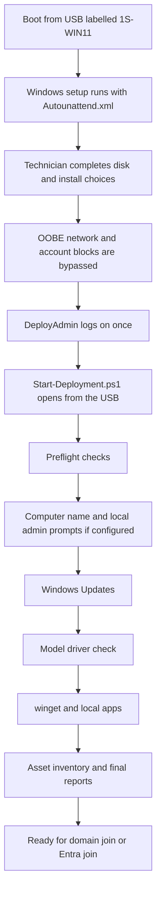
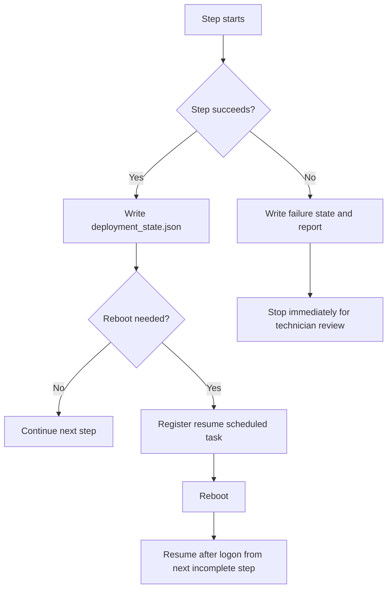

# Windows 11 Pro USB Deployment Toolkit

This repository extends an existing Microsoft Windows 11 installation USB labelled `1S-WIN11`.

It is designed for technician-led notebook deployment. It automates Windows setup handoff, preflight checks, Windows Update, model driver installation, app installation, asset capture, durable state, logging, and final reporting. It intentionally stops before domain join, Entra join, Autopilot registration, Intune enrollment, or any customer-specific identity work.

## What The Technician Sees

The technician boots from the USB, completes the normal Windows disk/install choices, then signs in with the temporary deployment admin created by `Autounattend.xml`. The deployment console opens, checks prerequisites first, prompts only where a decision is needed, writes progress after every successful step, and stops with a report saying the device is ready for final customer onboarding.





Expect these interaction points:

- Preflight failures stop before real work starts, so missing internet, wrong Windows edition, no AC power, missing config, or USB write problems are caught early.
- Reboots during rename or Windows Update are normal. The scheduled task resumes the same deployment on next logon.
- If a model driver folder is missing, the script creates the exact folder and lets the technician copy drivers and recheck, or continue without extra offline drivers.
- App installers only run when configured. Required app failures stop the run; optional app failures are logged.
- The final screen and report confirm that customer identity onboarding has not been performed.

## USB Layout

Copy this project to the root of the Windows 11 USB so the USB contains:

```text
Autounattend.xml
Deployment\
  Config\
  Scripts\
  State\
  Logs\
  Reports\
  Apps\
    Winget\
    Local\
  Drivers\
    Dell\
    HP\
    Lenovo\
    Generic\
  Tools\
```

The toolkit always finds the USB by volume label `1S-WIN11`, not by drive letter.

## Initialise Or Update The USB

From an elevated PowerShell prompt on an admin workstation:

```powershell
Set-ExecutionPolicy -Scope Process Bypass -Force
.\Initialize-UsbDeployment.ps1
```

If you are preparing files in a staging folder and want to target a known USB path:

```powershell
.\Initialize-UsbDeployment.ps1 -UsbRoot E:\
```

## Configuration

Edit the active config files under `Deployment\Config`:

- `deployment_config.json`
- `winget_packages.json`
- `local_apps.json`

Matching `.example.json` files are included as templates.

Important `deployment_config.json` options:

- `require_ac_power`: fail preflight on battery power for notebooks.
- `require_internet`: fail preflight when Windows Update and winget cannot reach the internet.
- `windows_update_max_cycles`: maximum update/reboot scan cycles. Default is `5`.
- `computer_name_mode`: `prompt`, `serial`, `prefix_serial`, or `skip`.
- `create_local_admin`: creates a configured local admin during the task sequence.
- `local_admin_password_mode`: `prompt` or `random`.
- `install_winget_apps`, `install_local_apps`, `install_offline_drivers`: enable or skip those phases.
- `stop_before_domain_join`: documents the intended stopping point. The scripts do not perform customer identity joins.

Do not store customer domain credentials in any config file.

## Security Notes

`Autounattend.xml` creates a temporary first-logon technician account named `DeployAdmin` with the default password `TempDeploy!ChangeMe11`.

Before production use, change this password in `Autounattend.xml`, protect physical access to the USB, and remove or disable the temporary account during final onboarding. The deployment task sequence can also create a separate local administrator account from `deployment_config.json`; the default mode prompts the technician for that password instead of storing it in a script.

If `local_admin_password_mode` is set to `random`, the toolkit only generates the password when `allow_random_password_export` is also `true`, because otherwise the credential would be lost. Generated password reports are sensitive and must be protected.

## Autounattend

Place `Autounattend.xml` at the USB root.

The provided file:

- does not partition or wipe disks.
- sets OOBE options to avoid Microsoft account and network blocking prompts.
- writes the Windows 11 `BypassNRO` registry value during setup instead of requiring `Shift+F10` and `oobe\BypassNRO.cmd`.
- creates the temporary `DeployAdmin` local administrator.
- auto-logs on once and starts `Deployment\Scripts\Start-Deployment.ps1` from the USB found by label.

Disk selection, deletion, partitioning, and image selection remain technician-led. If you want destructive disk partitioning, keep it in a separate answer file and treat it as a deliberate site-specific change.

## Driver Folders

Drivers must be stored as:

```text
Deployment\Drivers\<Manufacturer>\<Model>
```

Examples:

```text
Deployment\Drivers\HP\Pro_x360_435_G10
Deployment\Drivers\Dell\Latitude_5440
Deployment\Drivers\Lenovo\ThinkPad_T14_G4
```

Manufacturer names are normalised, for example:

- `HP Inc.` and `Hewlett-Packard` become `HP`
- `Dell Inc.` becomes `Dell`
- `LENOVO` becomes `Lenovo`

Model names are normalised by removing common noisy words and replacing spaces or invalid path characters with underscores.

After Windows Updates complete, `Install-ModelDrivers.ps1` detects the model and checks the expected folder:

- folder exists with `.inf` files: installs them with `pnputil /add-driver /subdirs /install`.
- folder exists but is empty: treats this as intentional and continues.
- folder is missing: creates it, shows the exact path, and lets the technician recheck after copying drivers or continue without offline drivers.

## App Installation

### winget

`Deployment\Config\winget_packages.json` contains package entries:

```json
{ "id": "Google.Chrome", "display_name": "Google Chrome", "required": true, "install_arguments": "" }
```

The script checks whether each package is already installed before installing it and accepts source/package agreements. Required package failures stop the task sequence when `fail_on_missing_required_app` is `true`.

### Local USB Apps

Place installers under:

```text
Deployment\Apps\Local
```

Configure each one in `Deployment\Config\local_apps.json`. Supported installer types are:

- `exe`
- `msi`
- `msix`
- `appx`
- `script`

Local installers are never run just because they exist. They must be explicitly configured with silent arguments and detection logic.

## State, Logs, And Reports

State is stored at:

```text
Deployment\State\deployment_state.json
```

After each successful step, the toolkit records device identity, current step, completed steps, timestamps, Windows build, manufacturer/model, run ID, last successful step, and errors.

Logs are written to:

```text
Deployment\Logs\<SerialOrComputerName>\<RunId>\
```

Reports are written to:

```text
Deployment\Reports\<SerialOrComputerName>\
```

Each run writes:

- PowerShell transcript log.
- JSONL structured event log.
- command stdout/stderr logs.
- JSON deployment report.
- Markdown deployment summary.
- JSON asset inventory.

## Resume And Reboot Handling

The toolkit registers a scheduled task named `OneSolutionWin11DeploymentResume` when a reboot is required. Repeated runs use the same task name and replace it rather than creating duplicates.

On rerun, the script:

- loads `deployment_state.json`.
- confirms serial number or UUID matches the current device.
- shows the last successful step.
- resumes from the next incomplete step.
- offers a safe restart-from-scratch option when running interactively.

Run manually at any time:

```powershell
powershell.exe -NoProfile -ExecutionPolicy Bypass -File .\Deployment\Scripts\Start-Deployment.ps1
```

To force a new run:

```powershell
.\Deployment\Scripts\Start-Deployment.ps1 -Reset
```

## Workflow

1. Create a Windows 11 USB with Microsoft `mediacreationtool.exe`.
2. Set the USB volume label to `1S-WIN11`.
3. Copy this toolkit to the USB root or run `Initialize-UsbDeployment.ps1`.
4. Edit config files under `Deployment\Config`.
5. Add model drivers under `Deployment\Drivers\<Manufacturer>\<Model>` when available.
6. Add configured local installers under `Deployment\Apps\Local`.
7. Boot the target notebook from the USB.
8. Install Windows 11 Pro using the technician-led setup flow.
9. Let `Autounattend.xml` bypass OOBE network/account blocking and launch the deployment script.
10. Follow prompts for computer name, local admin password, and any missing driver folder decision.
11. Review the final report.
12. Perform final customer onboarding manually: domain join, Entra join, Autopilot/Intune, customer apps, and handover steps.

## Failure Behaviour

Critical prerequisite failures stop immediately. Runtime task failures are written to state and reports before the script exits.

The toolkit does not continue blindly after a failed required update, driver, or app phase. Fix the cause, rerun `Start-Deployment.ps1`, and resume from the next incomplete step.
