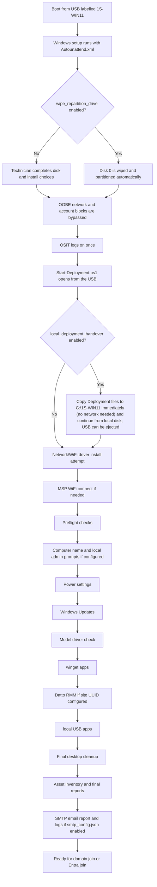
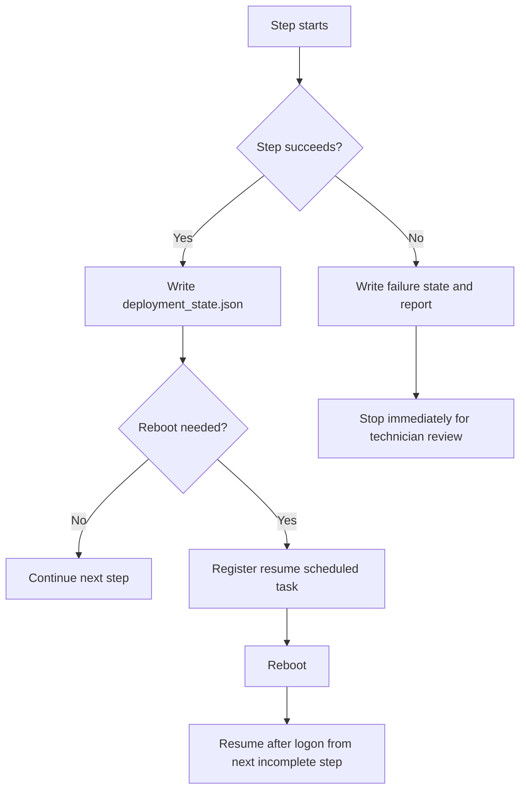

# Windows 11 Pro USB Deployment Toolkit

This repository extends an existing Microsoft Windows 11 installation USB labelled `1S-WIN11`.

It is designed for technician-led notebook deployment. It automates Windows setup handoff, preflight checks, Windows Update, model driver installation, app installation, asset capture, durable state, logging, and final reporting. It intentionally stops before domain join, Entra join, Autopilot registration, Intune enrollment, or any customer-specific identity work.

## What The Technician Sees

The technician boots from the USB, completes the normal Windows install choices unless automatic repartitioning is enabled, then signs in with the OSIT local admin created by `Autounattend.xml`. The deployment console opens, checks prerequisites first, prompts only where a decision is needed, writes progress after every successful step, and stops with a report saying the device is ready for final customer onboarding.





Expect these interaction points:

- Network/WiFi driver install runs before any network-dependent step, so a WiFi chip lacking an inbox driver has a chance to come online before MSP WiFi connect and preflight's internet check.
- Preflight failures stop before real work starts, so missing internet, wrong Windows edition, no AC power, missing config, or USB write problems are caught early.
- Reboots during rename or Windows Update are normal. The scheduled task resumes the same deployment on next logon.
- If a model driver folder is missing, the script creates the exact folder and lets the technician copy drivers and recheck, or continue without extra offline drivers.
- App installers only run when configured. Required app failures stop the run; optional app failures are logged.
- When `local_deployment_handover.enabled=true`, the toolkit copies itself to `C:\1S-WIN11` (or the configured `local_path`) as the very first step, before any network or driver work (no connectivity is required), and runs the entire rest of the deployment from there. The console and a toast notification confirm within the first minute when it is safe to eject the USB and move it to the next device.
- When `smtp_config.json` is enabled, the deployment report, Markdown summary, asset inventory, and a zip of the run's logs are emailed to the configured recipients at the end of the run (and on failure).
- The final screen and report confirm that customer identity onboarding has not been performed.

## USB Layout

Copy this project to the root of the Windows 11 USB so the USB contains:

```text
Autounattend.xml
OSIT-DiskPart.txt   (generated when wipe_repartition_drive=true)
Deployment\
  Config\
  Scripts\
  State\
  Logs\
  Reports\
  Apps\
    Winget\
    Local\
  Drivers\
    Dell\
    HP\
    Lenovo\
    Generic\
    Network\
      Intel\
      Realtek\
      Qualcomm\
      Broadcom\
      Generic\
  Tools\
```

The toolkit always finds the USB by volume label `1S-WIN11`, not by drive letter.

## Initialise Or Update The USB

**Edit `Deployment\Config\deployment_config.json` in this toolkit folder BEFORE running `Initialize-UsbDeployment.ps1`.** Settings such as `wipe_repartition_drive`, partition sizes, and `windows_image_name` are baked into the generated USB `Autounattend.xml` at initialise time. Changing the config afterwards has no effect until you rerun `Initialize-UsbDeployment.ps1`. The initializer validates the generated answer file against the config and fails if they do not match.

From an elevated PowerShell prompt on an admin workstation:

```powershell
Set-ExecutionPolicy -Scope Process Bypass -Force
.\Initialize-UsbDeployment.ps1
```

Initialisation refreshes toolkit-controlled files every time. Existing USB `Deployment\Logs` and `Deployment\Reports` are preserved, while `Deployment\State` is cleared so the next deployment starts with no stale resume state.

If you are preparing files in a staging folder and want to target a known USB path:

```powershell
.\Initialize-UsbDeployment.ps1 -UsbRoot E:\
```

## Configuration

Edit the active config files under `Deployment\Config`:

- `deployment_config.json`
- `winget_packages.json`
- `local_apps.json`
- `smtp_config.json`

Matching `.example.json` files are included as templates.

Detailed config references:

- `Deployment\Config\deployment_config.example.json.md`
- `Deployment\Config\winget_packages.example.json.md`
- `Deployment\Config\local_apps.example.json.md`
- `Deployment\Config\smtp_config.example.json.md`

Important `deployment_config.json` options:

- `wipe_repartition_drive`: when `true`, the generated USB `Autounattend.xml` wipes the configured disk and creates the standard OSIT UEFI/GPT layout before installing Windows. Default is `false`.
- `wipe_repartition_disk_id`: disk number to wipe. Default is `0`.
- `wipe_minimum_disk_count`: pre-wipe safety check threshold (default `2`, must be at least `2`): the generated USB refuses to wipe unless at least this many disks are visible in WinPE **and** the target disk is strictly larger than every other visible disk — see "Pre-Wipe Disk Safety Check" below.
- `efi_partition_size_mb`, `msr_partition_size_mb`, `recovery_partition_size_mb`: default to `512`, `16`, and `2048`.
- `windows_image_name`: image name to install from the USB. Default is `Windows 11 Pro`.
- `require_ac_power`: fail preflight on battery power for notebooks.
- `require_internet`: fail preflight when Windows Update and winget cannot reach the internet.
- `msp_wifi_setup`: connects to MSP WiFi SSID `OneSolution` before preflight internet checks. Password comes from `OSIT_WIFI_PASSWORD`, unless `Deployment\WifiProfiles\Primary.xml` exists, in which case that exported profile is imported directly instead. The step is skipped automatically when the device already has internet (for example Ethernet) or has no wireless adapter.
- `configure_additional_wifi_profiles` / `additional_wifi_profiles_connect_timeout_seconds`: imports every other WLAN profile XML in `Deployment\WifiProfiles\` (besides `Primary.xml`) after driver installation, verifying each on a best-effort basis, then switches back to the primary network. See "Additional WiFi Profiles" below.
- `local_deployment_handover`: when `enabled=true`, copies the deployment to `local_path` (default `C:\1S-WIN11`) as the very first step (no network required) and continues the rest of the deployment from there, so the USB can be ejected within the first minute. Default is `false`. See "Local Deployment Handover" below.
- `windows_update_max_cycles`: maximum update/reboot scan cycles. Default is `5`.
- `computer_name_mode`: `prompt`, `serial`, `prefix_serial`, or `skip`.
- `configure_power_settings`: sets power timeouts before long-running update and install stages.
- `power_timeout_battery_minutes`: defaults to `60`, meaning display/sleep after 1 hour on battery.
- `power_timeout_ac_minutes`: defaults to `0`, meaning never while plugged in.
- `power_disable_hibernate`: defaults to `true`. Runs `powercfg.exe /HIBERNATE OFF`, which also disables Fast Startup (it depends on hibernation). Takes priority over `power_manage_hibernate_timeout`.
- `osit_local_admin_username`: defaults to `OSIT`. This is the always-present primary local admin.
- `primary_setup_username`: defaults to `OSIT`.
- `final_resultant_user`: user profile whose Desktop should represent the final technician-ready desktop. Defaults to `OSIT`.
- `additional_local_users`: creates optional extra local accounts. Each entry supports `username`, `full_name`, `description`, `groups`, `password_mode`, `password_never_expires`, `enabled`, and `primary_setup_user`.
- `configure_system_tweaks`: runs bloatware removal, taskbar/Explorer tweaks, and hardening toggles (see `system_tweaks` in `deployment_config.example.json.md`) after app installation, before desktop item cleanup.
- `configure_desktop_items`: runs final desktop cleanup after app installation.
- `desktop_items`: controls Public Desktop and final user Desktop desired state.
- `datto_rmm_site_id_uuid`: optional Datto RMM site UUID. When present, Datto installs after hostname, Windows Updates, drivers, and winget, but before local USB apps.
- `datto_rmm_install_arguments`: optional arguments passed to the Datto installer.
- `datto_rmm_required`: when `true`, fail if the installer completes but Datto/CentraStage is not detected.
- `datto_rmm_install_timeout_seconds`: defaults to `300`. The installer process is known to sometimes remain resident (background check-in/self-update) after the agent is actually installed and running, so the toolkit polls for the agent alongside the process handle and stops waiting as soon as either happens -- it does not just block on the process exiting.
- `install_winget_apps`, `install_local_apps`, `install_offline_drivers`: enable or skip those phases.
- `winget_bootstrap`: when `true` and winget is not yet available at first logon, the toolkit re-registers App Installer and falls back to `Repair-WinGetPackageManager` from the `Microsoft.WinGet.Client` module before installing apps.
- `stop_before_domain_join`: documents the intended stopping point. The scripts do not perform customer identity joins.

Do not store customer domain credentials in any config file.

The OSIT password is not stored in `deployment_config.json`. `Initialize-UsbDeployment.ps1` reads it from either:

- environment variable: `OSIT_LOCAL_ADMIN_PASSWORD`
- `.env` in the toolkit folder: `OSIT_LOCAL_ADMIN_PASSWORD=...`

If neither exists, `Initialize-UsbDeployment.ps1` prompts to create one.

When `msp_wifi_setup.enabled=true`, the OneSolution WiFi password is also not stored in JSON. `Initialize-UsbDeployment.ps1` reads `OSIT_WIFI_PASSWORD` from the environment or `.env`, then writes it to the USB-root `.env` so `Configure-MspWifi.ps1` can connect before preflight internet checks.

When `smtp_config.json`'s `username` is non-blank, the SMTP password is likewise not stored in JSON. `Initialize-UsbDeployment.ps1` reads `OSIT_SMTP_PASSWORD` (or the name configured in `password_env_var`) from the environment or `.env`, then writes it to the USB-root `.env` so `Send-DeploymentEmail.ps1` can authenticate.

Example additional local account config:

```json
"primary_setup_username": "OSIT",
"additional_local_users": [
  {
    "username": "TechSupport",
    "full_name": "Technician Support",
    "description": "Optional technician support account",
    "groups": [ "Administrators" ],
    "password_mode": "prompt",
    "password_never_expires": true,
    "enabled": true,
    "primary_setup_user": false
  }
]
```

Example desktop config:

```json
"final_resultant_user": "OSIT",
"configure_desktop_items": true,
"desktop_items": {
  "manage_common_desktop": true,
  "manage_final_user_desktop": true,
  "remove_unapproved_shortcuts": true,
  "preserve_patterns": [ "desktop.ini" ],
  "common_desktop_items": [],
  "final_user_desktop_items": [
    {
      "name": "Company Portal",
      "type": "url",
      "url": "https://portal.manage.microsoft.com",
      "enabled": false
    }
  ]
}
```

With `remove_unapproved_shortcuts=true` and an empty `common_desktop_items` list, winget/MSI shortcuts dropped onto the Public Desktop are removed. Add approved entries to keep or create only the shortcuts you want.

Example Datto RMM config:

```json
"datto_rmm_site_id_uuid": "1193f864-66b2-49fd-bafe-950ba1e803e5",
"datto_rmm_install_arguments": "",
"datto_rmm_required": true
```

The Datto UUID is validated during preflight. If it is blank, the Datto install step is skipped.

## Security Notes

`Autounattend.xml` creates the OSIT local administrator account and auto-logs it on once to start the deployment console.

At the end of a successful run, the `Complete` step scrubs cached copies of the answer file (`C:\Windows\Panther`, sysprep) and the Winlogon `DefaultPassword`/autologon registry values so the OSIT password does not remain on the installed system in plaintext.

The repository `Autounattend.xml` contains the placeholder `__OSIT_LOCAL_ADMIN_PASSWORD__`. `Initialize-UsbDeployment.ps1` replaces that placeholder when writing the USB-root `Autounattend.xml`. The generated USB answer file contains the OSIT password in plaintext because Windows setup requires it for local account creation and auto-logon. Protect physical access to the USB.

There are two account stages:

- `Autounattend.xml`: controls the always-present OSIT account that logs in first and launches the deployment console.
- `Deployment\Config\deployment_config.json`: controls optional extra accounts. Use `additional_local_users` only when accounts beyond OSIT are required.

The script does not silently switch Windows sessions after creating accounts. If `primary_setup_username` differs from the current logged-in user, the console warns the technician to sign out and sign in as the primary setup user before continuing or resuming.

If an additional account `password_mode` is set to `random`, the toolkit only generates the password when `allow_random_password_export` is also `true`, because otherwise the credential would be lost. Generated password reports are sensitive and must be protected.

`Send-DeploymentEmail.ps1` only ever attaches the run's `deployment-report-*.json`, `deployment-summary-*.md`, `asset-inventory-*.json`, and (if `attach_logs=true`) a zip of the run's log folder. It never attaches generated local-user password reports (`local-user-password-*.txt`), even though those live in the same `Deployment\Reports` folder. Point `smtp_config.json`'s `to_addresses`/`cc_addresses` at a trusted internal distribution list, since the log/report contents include device serials, computer names, and installed software.

## Autounattend

Place `Autounattend.xml` at the USB root.

The repository `Autounattend.xml` is a template. `Initialize-UsbDeployment.ps1` writes the real USB-root file after injecting the OSIT password and, if configured, the disk partitioning block.

By default, `wipe_repartition_drive` is `false`, so disk selection, deletion, partitioning, and image selection remain technician-led.

When `wipe_repartition_drive` is `true`, the generated USB answer file wipes `wipe_repartition_disk_id` and creates this GPT/UEFI layout:

| Partition | Filesystem | Size | Notes |
| --- | --- | ---: | --- |
| EFI System (ESP) | FAT32 | 512 MB | Larger than Microsoft's minimum. |
| MSR | None | 16 MB | Microsoft's standard. |
| Windows (C:) | NTFS | Remaining space minus WinRE | Main OS partition. |
| Windows Recovery (WinRE) | NTFS | 2 GB | Room for future WinRE updates and recovery tools. |

The generated file:

- can wipe and repartition the configured disk when `wipe_repartition_drive` is `true`.
- sets OOBE options to avoid Microsoft account and network blocking prompts.
- writes the Windows 11 `BypassNRO` registry value during setup instead of requiring `Shift+F10` and `oobe\BypassNRO.cmd`.
- creates the `OSIT` local administrator.
- auto-logs on once and starts `Deployment\Scripts\Start-Deployment.ps1` from the USB found by label.

When `wipe_repartition_drive` is `true`, `Initialize-UsbDeployment.ps1` writes five partitioning artifacts:

- `OSIT-DiskCheck.cmd` at the USB root: a pre-wipe safety check (see "Pre-Wipe Disk Safety Check" below).
- `OSIT-DiskDiag.vbs` at the USB root: on-failure diagnostic, invoked by `OSIT-DiskCheck.cmd` (see "Pre-Wipe Disk Safety Check" below).
- `OSIT-DiskPart.txt` at the USB root: the full diskpart script (`select disk`, `clean`, `convert gpt`, partition creation, WinRE type and attributes).
- Two short `windowsPE` RunSynchronous commands inside the generated `Autounattend.xml`, in order: Order 1 scans drive letters for `OSIT-DiskCheck.cmd` and runs it; Order 2 scans drive letters for `OSIT-DiskPart.txt`, runs `diskpart /s` against it, and writes diskpart output to `OSIT-DiskPart.log` at the USB root for diagnostics. Order 2 only runs `diskpart` if `OSIT-DiskCheck.ok` (written by `OSIT-DiskCheck.cmd` itself only after every check in step 3/4 below passes) also exists — confirmed necessary in the field: Windows Setup does not reliably abort the `windowsPE` pass just because Order 1 exits non-zero, so a machine that failed the safety check below still had Order 2 wipe its USB stick. Order 2's own command line checks for the sentinel directly rather than trusting Setup's error handling.

Neither script can be embedded in the answer file directly because the unattend schema caps each RunSynchronous command at 259 characters. Each `windowsPE` command only locates and runs its own USB-root script file. The diskpart script assigns temporary letters `S` and `W` (never `C`, which WinPE frequently gives to the USB stick when the target disk is blank) and uses `noerr` so a letter collision cannot abort partition creation. Windows is installed to disk `wipe_repartition_disk_id`, partition 3, by ID rather than by drive letter.

If partitioning fails, read `OSIT-DiskPart.log` on the USB root to see exactly which diskpart command stopped. If Windows Setup stops before wiping the disk at all, read `OSIT-DiskCheck.log` on the USB root first.

Treat `wipe_repartition_drive=true` as destructive. It is intended for standardised deployments where disk 0 is the target OS disk -- confirm this holds for a given model before relying on it: WinPE's disk numbering follows firmware/controller enumeration order, not "internal disks first," so a specific machine can enumerate its USB boot media as disk 0 even with an internal disk present (see "Pre-Wipe Disk Safety Check" below for the safety net that catches this).

### Pre-Wipe Disk Safety Check

A bare Windows image with a missing boot-critical storage/RAID/NVMe driver can leave WinPE seeing only one fixed disk — the USB/boot media itself — which would then resolve to "disk 0" and get wiped by `OSIT-DiskPart.txt` instead of the client's internal disk. `OSIT-DiskCheck.cmd` runs first (Order 1, before `OSIT-DiskPart.txt`'s Order 2) to guard against exactly this:

1. Loads every `.inf` driver under the USB's `Deployment\Drivers\Storage\<Vendor>` folders with `drvload`, giving a missing storage driver a chance to make the real internal disk visible.
2. Re-enumerates disks with `diskpart list disk`.
3. Refuses to continue (`exit /b 1`) unless at least `wipe_minimum_disk_count` disks are visible **and** the `wipe_repartition_disk_id` disk is strictly larger in size than every other visible disk. A client notebook's internal disk is always larger than the deployment USB, so a target disk that is not the single largest visible disk means the USB/boot media (or another removable device) has taken the configured disk ID. These two relative checks deliberately replaced earlier absolute thresholds (a minimum target size in GB) and per-property WMI assertions (partition count, interface type, media type, maximum size, in a companion `OSIT-DiskAssert.vbs`): the absolute checks false-failed in the field on a machine whose disk 0 genuinely was the internal disk — an existing base Windows 11 install meant it already had partitions — while the relative comparison holds on any hardware without per-model tuning. The best fix for a machine that fails this check is to integrate its storage controller driver into the media itself with `IntegrateDriversToWindowsInstall.ps1`, so the internal disk is visible from the moment Setup boots and enumerates ahead of the USB.

Only if both checks pass does `OSIT-DiskCheck.cmd` write `OSIT-DiskCheck.ok` to the USB root (deleting any stale copy first) and exit `0`. Order 2's `diskpart` RunSynchronous command independently requires that file to exist before it will run `diskpart` at all — this does **not** rely on Windows Setup treating Order 1's non-zero exit as fatal, because in the field it did not: a machine whose disk enumeration put the USB stick itself at `wipe_repartition_disk_id` failed this exact check (correctly), and Windows Setup still went on to run Order 2's `diskpart` wipe against it, destroying the USB's own partitions. Disk enumeration order in WinPE is not guaranteed to put the internal disk first — a laptop with an existing OEM Windows install can still enumerate its USB boot media as disk 0, not just the "missing storage driver" scenario this check was originally designed around.

If either check in step 3 fails, `OSIT-DiskCheck.cmd` runs the companion `OSIT-DiskDiag.vbs` script before exiting: it gathers, via WMI, the notebook's own make/model (`Win32_ComputerSystem`) and serial number (`Win32_BIOS`), every disk WinPE can currently see (`Win32_DiskDrive`, each labelled with its actual PHYSICALDRIVE/diskpart disk number rather than an arbitrary list position, so it can be read straight back into `wipe_repartition_disk_id`), and every PnP device with no working driver (`Win32_PnPEntity` where `ConfigManagerErrorCode <> 0`, whose `PNPDeviceID` `VEN_`/`DEV_` tokens identify exactly which storage controller chipset needs a driver). If any OTHER visible disk is fixed/non-removable and at least as large as the configured target disk, the report calls it out by disk number as a likely-correct candidate — this is diagnostic guidance only (integrate the storage driver into the media with `IntegrateDriversToWindowsInstall.ps1`, or update `wipe_repartition_disk_id` and regenerate the USB), not something the toolkit can act on itself: Windows Setup reads `ImageInstall`/`InstallTo`/`DiskID` from the answer file into memory before any `windowsPE` `RunSynchronousCommand` runs, so nothing running at check time can change which disk Setup will actually install to. This is both saved to `OSIT-DiskDiag.log` at the USB root and shown immediately as an on-screen dialog, so a technician does not have to dig through log files to find out what is missing or which disk to configure.

Every step is logged to `OSIT-DiskCheck.log` at the USB root: which drivers were loaded, the full `diskpart list disk` output, the disk count, the target disk's size and the largest other disk's size it detected, and the pass/fail reason. If Windows Setup stops with an error before any disk activity, read this file first (or `OSIT-DiskDiag.log` for the make/model/serial and driver-less-device summary).

Drop boot-critical storage/RAID/NVMe driver packages (`.inf` plus their `.sys`/`.cat`/`.dll` files) under `Deployment\Drivers\Storage\<Vendor>` — this is a separate, WinPE-time convention from the post-install `Deployment\Drivers\<Manufacturer>\<Model>` and `Deployment\Drivers\Network\<Vendor>` folders documented below, because `drvload` runs before Windows itself is even installed. Default vendor folders created on the USB: `Deployment\Drivers\Storage\Intel`, `Deployment\Drivers\Storage\AMD`, `Deployment\Drivers\Storage\Generic`. An empty or missing folder is skipped, same as the Network vendor folders.

Validate the repository template:

```powershell
.\Validate-Unattend.ps1
```

Validate a generated USB-root answer file:

```powershell
.\Validate-Unattend.ps1 -Path E:\Autounattend.xml -Generated -ConfigPath E:\Deployment\Config\deployment_config.json
```

For full Microsoft schema validation, install the Windows ADK or pass `-DllPath` pointing to `Microsoft.ComponentStudio.ComponentPlatformInterface.dll`. Without that DLL, the validator still performs XML and toolkit-specific semantic checks.

To let the validator install the ADK packages with winget when the schema DLL is missing:

```powershell
.\Validate-Unattend.ps1 -InstallAdkWithWinget -RequireSchema
```

This uses winget IDs `Microsoft.WindowsADK` and `Microsoft.WindowsADK.WinPEAddon`.

The `windowsPE` pass is the Windows Setup phase that runs inside Windows PE before the installed operating system is applied. This toolkit uses it only in generated answer files when `wipe_repartition_drive=true`, because that is where disk wipe, GPT partitioning, and image install target settings must be applied.

The same `windowsPE` block also carries a `UserData/ProductKey` matching `windows_image_name` (Microsoft's publicly documented generic KMS client setup key for that edition, from `Get-KmsClientSetupKey` in `UnattendGeneration.ps1`) so Windows Setup's interactive "Enter your product key" page never blocks an unattended run. This exists mainly for Hyper-V rehearsal VMs: a real notebook's firmware normally carries an OEM digital license that Windows Setup detects on its own and skips that page for, but a VM has no such firmware entry and otherwise sits there waiting for a technician to click "I don't have a product key." A real machine's genuine OEM firmware entitlement still takes over activation after install either way.

If Windows Setup fails before wiping the disk with `0x80004005 - 0x40030`, regenerate the USB files with `Initialize-UsbDeployment.ps1` and validate the USB-root answer file. Older generated answer files embedded the entire diskpart script in the `windowsPE` command, exceeding the 259-character unattend `Path` limit and causing exactly this error; regenerating produces the current short command plus the USB-root `OSIT-DiskPart.txt` script file.

## Driver Folders

Drivers must be stored as:

```text
Deployment\Drivers\<Manufacturer>\<Model>
```

Examples:

```text
Deployment\Drivers\HP\Pro_x360_435_G10
Deployment\Drivers\Dell\Latitude_5440
Deployment\Drivers\Lenovo\ThinkPad_T14_G4
```

Manufacturer names are normalised, for example:

- `HP Inc.` and `Hewlett-Packard` become `HP`
- `Dell Inc.` becomes `Dell`
- `LENOVO` becomes `Lenovo`

Model names are normalised by removing common noisy words and replacing spaces or invalid path characters with underscores.

After Windows Updates complete, `Install-ModelDrivers.ps1` detects the model and checks the expected folder:

- folder exists with `.inf` files: installs them with `pnputil /add-driver /subdirs /install`.
- folder exists but is empty: treats this as intentional and continues.
- folder is missing: creates it, shows the exact path, and lets the technician recheck after copying drivers or continue without offline drivers.

### Network/WiFi Driver Folders (Installed Before Any Network Step)

A bare Windows 11 image sometimes has no inbox driver for the installed WiFi chip, which would otherwise make `MspWifiSetup` and `Preflight`'s internet check fail before `Install-ModelDrivers.ps1` ever gets a chance to run (it runs after Windows Update, much later). To cover this, the `NetworkDrivers` step runs **first**, before `MspWifiSetup` and `Preflight`, and installs every vendor folder under:

```text
Deployment\Drivers\Network\<Vendor>
```

Default vendor folders created on the USB:

```text
Deployment\Drivers\Network\Intel
Deployment\Drivers\Network\Realtek
Deployment\Drivers\Network\Qualcomm
Deployment\Drivers\Network\Broadcom
Deployment\Drivers\Network\Generic
```

Any subfolder name works; these are just a starting point. Drop the WiFi/NIC driver package for each vendor you support into its own folder — for example, if a fleet mixes three different WiFi chip vendors, populate all three folders and every vendor folder is tried on every deployment. `pnputil` only binds a driver to hardware whose ID actually matches, so trying an unrelated vendor's package on a machine that doesn't have that chip is a harmless no-op, not an error. Empty vendor folders are skipped; a missing vendor folder is recreated automatically and then skipped the same way.

Controlled by `install_network_drivers` in `deployment_config.json` (default `true`).

## App Installation

### winget

`Deployment\Config\winget_packages.json` contains package entries:

```json
{ "id": "Google.Chrome", "display_name": "Google Chrome", "required": true, "install_arguments": "" }
```

The script checks whether each package is already installed before installing it and accepts source/package agreements. Required package failures stop the task sequence when `fail_on_missing_required_app` is `true`.

### Local USB Apps

Place installers under:

```text
Deployment\Apps\Local
```

Configure each one in `Deployment\Config\local_apps.json`. Supported installer types are:

- `exe`
- `msi`
- `msix`
- `appx`
- `script`

Local installers are never run just because they exist. They must be explicitly configured with silent arguments and detection logic.

## Local Deployment Handover (Eject The USB Early)

By default the toolkit runs entirely from the USB for the whole deployment, exactly as before. Setting `local_deployment_handover.enabled=true` in `deployment_config.json` adds a `LocalHandover` step, which runs first (before network/WiFi driver installation, MSP WiFi connect, and `Preflight`) and needs no network connection: it is a local USB-to-disk copy, and `require_network` defaults to `false`. It:

1. Copies the entire `Deployment` folder (Config, Scripts, Apps, Drivers, Tools, and the current run's State/Logs/Reports) plus the USB-root `.env` to `local_deployment_handover.local_path` (default `C:\1S-WIN11`) using `robocopy`.
2. Verifies the copy landed correctly, then switches the running deployment, its logging, the resume scheduled task, and the technician Resume/Status desktop shortcuts over to the local copy.
3. Logs success and shows a toast confirming the USB can now be safely ejected.

Every remaining step — network/WiFi drivers, MSP WiFi, preflight, computer name, local admin, power settings, Windows Updates, drivers, winget/local apps, Datto RMM, desktop cleanup, reports, and email — then runs from the local copy. If a reboot is required later in the run, the resume scheduled task and automatic logon both point at the local copy, not the USB, so ejecting it beforehand does not break resume.

Handover needs no network, so it is never skipped for connectivity reasons by default. If a site opts back in to the old gating with `require_network=true`, handover is skipped (not failed) when no network connection is available at that moment (and since `LocalHandover` runs before any network/WiFi step, that effectively means always skipped on WiFi-only devices); the deployment then simply continues entirely from the USB, same as with `local_deployment_handover.enabled=false`.

This is disabled by default. Enable it once you are ready to have technicians eject the USB partway through a deployment and reuse it on the next device.

## Additional WiFi Profiles

`Deployment\WifiProfiles\` holds WLAN profile XML files exported via `netsh wlan export profile key=clear` (which preserves the network's key in plaintext inside the file, `protected=false`, so the profile actually works when imported on a different machine).

- `Primary.xml`, if present, is what `MspWifiSetup` imports for the primary network, instead of building a profile from `msp_wifi_setup`'s `ssid`/`password_env_var`/`authentication`/`encryption` fields. No `OSIT_WIFI_PASSWORD` lookup happens in that case — `Initialize-UsbDeployment.ps1` detects the file and skips prompting for the password entirely.
- Every other `.xml` file in the folder is a secondary profile. The `AdditionalWifiProfiles` step runs after `ModelDrivers` and before `WingetApps`/`DattoRmm`/`LocalApps` — late enough that Windows Update has already finished, early enough that nothing yet depends on sustained network access for downloads, so briefly hopping between networks here does not interrupt anything:
  1. Imports and saves every secondary profile (`netsh wlan add profile`), which always succeeds regardless of whether the network is actually in range right now.
  2. Attempts to connect to each one and waits up to `additional_wifi_profiles_connect_timeout_seconds`. A profile that cannot connect within that time is left imported and saved anyway, and this is logged as expected, not a failure — secondary profiles are typically captured ahead of time for a customer's own site network, which usually is not in range on the bench.
  3. Switches back to (or reconnects to) the primary network and confirms it, so every later step still has real connectivity. Only failing to reconnect to primary **and** having no other connectivity (e.g. Ethernet) at all is treated as fatal.

Treat everything in `Deployment\WifiProfiles\` as a secret: `key=clear` means these files contain real, plaintext network passwords. The folder's contents are gitignored the same way `.env` is — only `.gitkeep` is committed.

## SMTP Email Notifications

`Deployment\Config\smtp_config.json` (documented in `Deployment\Config\smtp_config.example.json.md`) controls emailing the deployment report, Markdown summary, asset inventory, and a zip of the run's logs to a distribution list. It is disabled by default.

Once `smtp_server` and `to_addresses` are configured and `enabled=true`, email is sent by the `EmailReport` step (after `FinalReport`, before `Complete`) on a successful run, and from the top-level failure handler if the task sequence stops on an error. Both are controlled independently by `send_on_success`/`send_on_failure`.

Email notification is best-effort: any SMTP failure is logged and does not stop or fail the deployment.

The SMTP password uses the same `.env`/environment variable pattern as `OSIT_LOCAL_ADMIN_PASSWORD` and `OSIT_WIFI_PASSWORD` — see `OSIT_SMTP_PASSWORD` above.

## State, Logs, And Reports

State is stored at:

```text
Deployment\State\deployment_state.json
```

After each successful step, the toolkit records device identity, current step, completed steps, timestamps, Windows build, manufacturer/model, run ID, last successful step, and errors.

Logs are written to:

```text
Deployment\Logs\<SerialOrComputerName>\<RunId>\
```

Reports are written to:

```text
Deployment\Reports\<SerialOrComputerName>\
```

Each run writes:

- PowerShell transcript log.
- JSONL structured event log.
- command stdout/stderr logs.
- JSON deployment report.
- Markdown deployment summary.
- JSON asset inventory.

All of the above are relative to the deployment root. If `local_deployment_handover` moves the deployment to `C:\1S-WIN11` (or your configured `local_path`), state, logs, and reports from that point on live under `C:\1S-WIN11\Deployment\...` instead of the USB, carried forward from whatever the USB already had at handover time.

## Dry Run

`-DryRun` runs the entire orchestrator, in order, on any machine with the toolkit checked out, and logs exactly what each step *would* do without changing anything. Use it:

- after editing `deployment_config.json` or any other config/profile file, as a sanity check that the new settings parse and drive the steps the way you expect.
- before running `Initialize-UsbDeployment.ps1` against a real USB, to catch a configuration mistake cheaply.
- on a bench PC or a CI runner that is not the target notebook at all, since dry run never requires the `1S-WIN11` USB label when `-UsbRoot` is passed explicitly.

Run it with:

```powershell
powershell.exe -NoProfile -ExecutionPolicy Bypass -File .\Deployment\Scripts\Start-Deployment.ps1 -UsbRoot <path> -DryRun
```

`-DryRun` implies `-NonInteractive` unless you explicitly override it, always starts from a fresh run (it never resumes or prompts about stale state), and announces the mode loudly at the console and in the log.

What still runs for real: every detection, scan, and validation step, exactly as in a real deployment. Preflight checks, Windows Update scans, winget package detection, driver `.inf` enumeration, asset inventory collection, and the `Complete` step's credential-scrub preview all run against the real machine, because that detection is the actual value of a dry run.

What never happens: no computer rename, no local user creation, no scheduled task registration, no desktop shortcut creation/removal, no automatic-logon registry changes, no WLAN profile changes, no driver installs, no app installs/updates, no reboot, and no email send. Every one of those is replaced by a log line prefixed `DRYRUN` and an entry in the run's `dryrun_actions` audit trail. A step that would normally request a reboot instead records the request and lets the dry run continue straight on to the next step, so one pass always walks every step in `Get-DeploymentSteps` order.

Dry run never touches a real deployment's state or logs. It reads and writes its own shadow files instead:

```text
Deployment\State\deployment_state.dryrun.json
Deployment\Logs\<SerialOrComputerName>\dryrun-<RunId>\
Deployment\Reports\<SerialOrComputerName>\dryrun\
```

At the end of a successful run, the console and log print a one-line result, for example:

```text
DRYRUN RESULT: steps=17 actions=23 would-reboot=1
```

and a Markdown report is written to `Deployment\Reports\<SerialOrComputerName>\dryrun\dryrun-summary-<RunId>.md`, grouping every recorded action under a heading per step (only steps that actually logged something), each with its timestamp and a compact JSON rendering of the action's data so nothing is dropped.

A `dryrun-smoke` job in `.github/workflows/ci.yml` runs `Start-Deployment.ps1 -DryRun` against the checked-out toolkit itself on every pull request, with a CI-only config overlay that relaxes settings specific to a GitHub-hosted runner (no winget/WLAN/Datto RMM dependency, relaxed free-space/pending-reboot checks), then asserts the run exits `0`, the summary report was written, and no local user, scheduled task, or computer rename was left behind on the runner.

## Resume And Reboot Handling

The toolkit maintains a scheduled task named `OneSolutionWin11DeploymentResume` under the `\1S-WIN11` Task Scheduler folder, with a plain-language description explaining what it does, that the 1S-WIN11 deployment toolkit created it, and that it is removed automatically when the deployment completes. Repeated registrations use the same task name and replace it rather than creating duplicates. The task is registered at two points, with two trigger profiles:

- **At every run start**, before the first step runs: an at-logon trigger plus an hourly recurring retry (for up to 14 days). This is an always-on safety net: if the deployment fails at any step (for example a missing WiFi driver stops `MspWifiSetup`), the retry re-runs it every hour, so fixing the blocker (plugging in Ethernet, dropping a driver into the toolkit) lets the deployment recover on its own from the last completed step.
- **When a reboot is required mid-run**: an at-logon trigger plus a 5-minute recurring backstop (for up to 3 days), so the deployment resumes promptly after the reboot even if the logon trigger does not fire for some reason (for example, a session restore path that does not generate a fresh logon event). Once the resumed run starts, its own run-start registration re-arms the hourly profile.

Alongside the run-start registration, two shortcuts are created on the common desktop and kept pointing at the current deployment root (re-targeted to `C:\1S-WIN11` after a local handover): `Resume 1S-WIN11 Deployment.lnk`, which relaunches the deployment elevated from the last completed step, and `1S-WIN11 Deployment Status.lnk`, which opens the read-only status view. The `DesktopItems` cleanup step always preserves both while the deployment is incomplete; the `Complete` step removes them along with the scheduled task (and the `\1S-WIN11` scheduler folder, once empty).

Both triggers are bound to the account by SID rather than by `ComputerName\Username`, so the task keeps matching the account even if the same reboot also renames the computer (a common first reboot, since `ConfigureComputerName` runs early).

To keep resumes genuinely unattended across every deployment-triggered reboot (not just the very first one after Windows install), the toolkit temporarily re-enables Windows automatic logon for the OSIT account before each such reboot, using the same `Winlogon` mechanism `Autounattend.xml` already uses for the first boot. This is scrubbed again in the `Complete` step along with the rest of the autologon values, so the device does not retain automatic logon or a plaintext password once deployment finishes. If the OSIT password cannot be found at reboot time, automatic logon is skipped and a technician must log on manually to resume, as before.

If two triggers happen to fire close together (or a technician manually reruns the script while a triggered resume is already active), `Start-Deployment.ps1` takes an exclusive lock for the duration of the run; a second instance detects this and exits immediately without touching `deployment_state.json`, rather than racing the first instance.

On rerun, the script:

- loads `deployment_state.json`.
- confirms serial number or UUID matches the current device.
- shows the last successful step.
- resumes from the next incomplete step.
- offers a safe restart-from-scratch option when running interactively.

Run manually at any time:

```powershell
powershell.exe -NoProfile -ExecutionPolicy Bypass -File .\Deployment\Scripts\Start-Deployment.ps1
```

To force a new run:

```powershell
.\Deployment\Scripts\Start-Deployment.ps1 -Reset
```

### Checking Deployment Status

To check whether a deployment is currently running, waiting for a reboot, stalled, failed, or complete, from an elevated PowerShell prompt on the device (or a technician session on it):

```powershell
powershell.exe -NoProfile -ExecutionPolicy Bypass -File .\Deployment\Scripts\Get-DeploymentStatus.ps1
```

This reports the overall status, current and last-completed step, progress out of the total step count, how long ago the state file and logs were last updated, whether a matching `Start-Deployment.ps1`/`Resume-Deployment.ps1` process is currently running, and the resume scheduled task's registration state. Add `-Json` for machine-readable output, or `-RefreshSeconds 15` to keep the report refreshing in place instead of a one-shot check.

Overall status values:

- `NotStarted` — no state file yet.
- `Running` — a matching deployment process is currently active.
- `Failed` — a recorded error exists and nothing is currently running.
- `WaitingForReboot` — the deployment itself requested a reboot and is waiting to resume.
- `Completed` — the `Complete` step has run.
- `Stalled` — state exists but none of the above explain it, which usually means the process was killed or crashed without recording a failure.

### Toast Notifications

Key deployment moments show a Windows toast notification to the interactively logged-on technician session: deployment start/resume, a reboot being requested, technician action needed (computer name prompt, missing model driver folder), deployment failure, and final completion. Toasts are best-effort only — if they cannot be shown (for example a non-interactive session), the deployment continues normally and this is logged at Debug level, never treated as a failure. The console output from `Write-Log` remains the authoritative, always-available record.

## Workflow

1. Create a Windows 11 USB with Microsoft `mediacreationtool.exe`.
2. Set the USB volume label to `1S-WIN11`.
3. Edit config files under `Deployment\Config` in this toolkit folder first, especially `wipe_repartition_drive`. These values are baked into the generated USB answer file in the next step.
4. Run `Initialize-UsbDeployment.ps1` to write the toolkit and generated `Autounattend.xml` to the USB. Rerun it after any config change.
5. Add model drivers under `Deployment\Drivers\<Manufacturer>\<Model>` when available.
6. Add configured local installers under `Deployment\Apps\Local`.
7. Boot the target notebook from the USB.
8. Install Windows 11 Pro using the technician-led setup flow, or let `wipe_repartition_drive=true` wipe and target disk 0 automatically.
9. Let `Autounattend.xml` bypass OOBE network/account blocking and launch the deployment script.
10. If `local_deployment_handover.enabled=true`, wait for the toast/console confirmation (within the first minute, before drivers or updates run) that files were copied to the local disk, then eject the USB.
11. Follow prompts for computer name, local admin password, and any missing driver folder decision.
12. Review the final report, delivered by email too if `smtp_config.json` is enabled.
13. Perform final customer onboarding manually: domain join, Entra join, Autopilot/Intune, customer apps, and handover steps.

## Failure Behaviour

Critical prerequisite failures stop immediately. Runtime task failures are written to state and reports before the script exits.

The toolkit does not continue blindly after a failed required update, driver, or app phase. Fix the cause, rerun `Start-Deployment.ps1`, and resume from the next incomplete step.

## Testing

This toolkit has a three-tier testing strategy: CI unit tests (`Tests/Unit`), the `-DryRun` mode documented above, and a Hyper-V rehearsal harness (`Test\Rehearsal`) that boots a real virtual machine and runs the entire unattended flow end-to-end. See [`TESTING.md`](TESTING.md) for a decision guide on which tier to use for a given change, exact commands, expected durations, how to read each tier's report, and a pre-release checklist.
